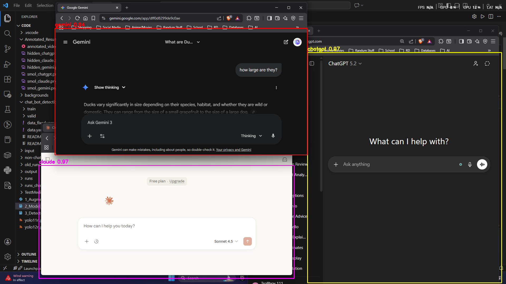

# Vision-Based AI Chatbot Detector

AI-powered computer vision system for detecting ChatGPT, Gemini, and Claude interfaces using YOLO, OpenCV, and synthetic dataset generation.

## Features

- YOLO-based chatbot UI detection
- Synthetic dataset generation pipeline
- Geometric and photometric augmentation
- Detection of partially hidden chatbot windows
- Detection of very small chatbot windows
- Real-time inference on screenshots and video

## Tech Stack

- Python
- OpenCV
- YOLOv12
- NumPy
- Pandas
- Jupyter Notebook
- Ultralytics

## Example Detection

